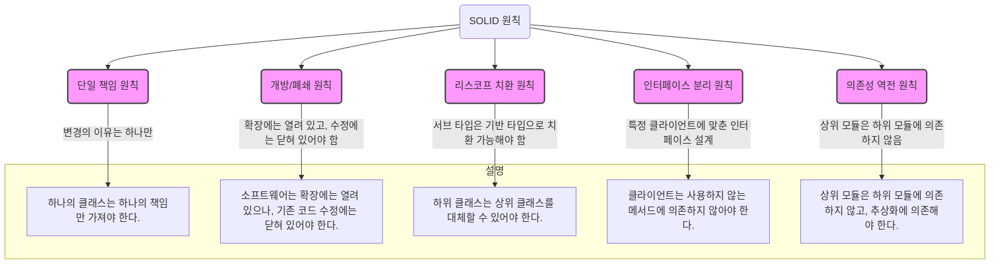
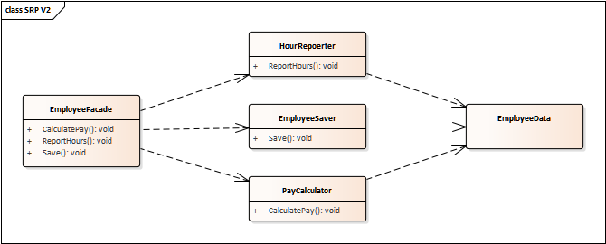
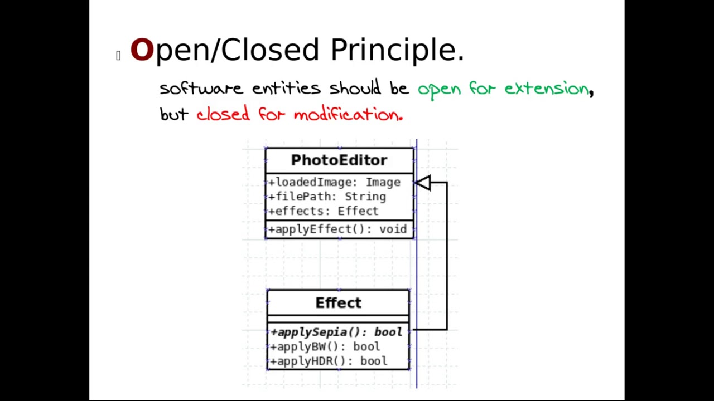
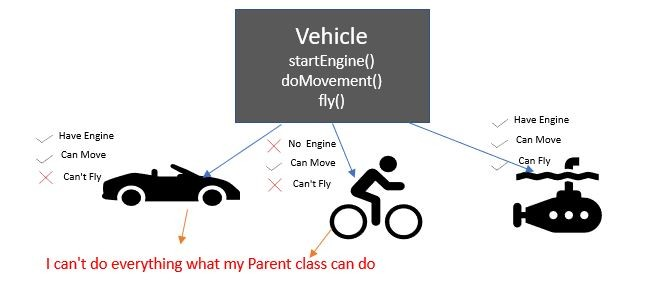
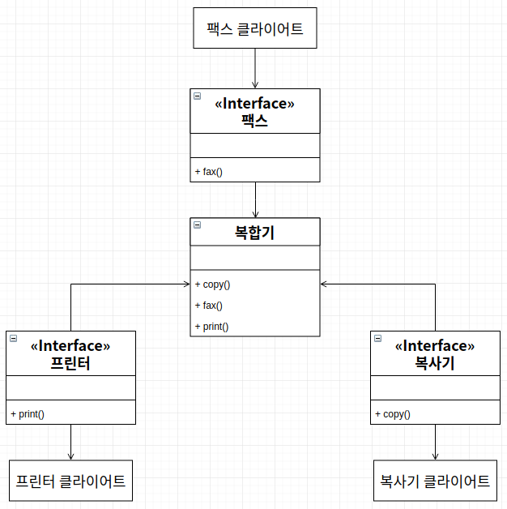
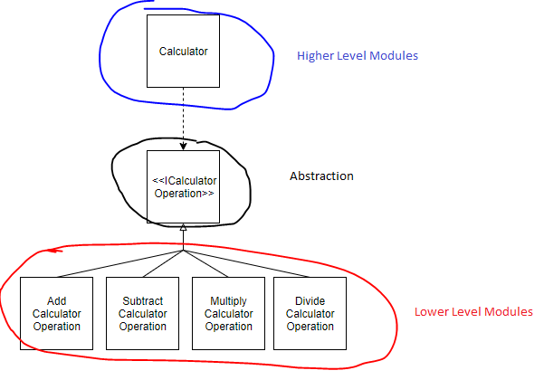

## SOLID 원칙 공부 노트
각 ipynb 설명내용 참조: https://velog.io/@haero_kim/SOLID-%EC%9B%90%EC%B9%99-%EC%96%B4%EB%A0%B5%EC%A7%80-%EC%95%8A%EB%8B%A4

### 1. SRP
이미지 참조: https://www.evertop.pl/en/understanding-solid-principles-single-responsibility/

### 2. OCP
이미지 참조:https://www.youtube.com/watch?v=H7oyqncSgEE

### 3. LSP
이미지 참조:https://www.linkedin.com/pulse/liskov-substitution-principle-mamata-raote-she-her-

### 4. ISP
이미지 참조:https://walbatrossw.github.io/oop/2018/07/27/07-solid-isp.html

### 5. DIP
이미지 참조: https://medium.com/@kedren.villena/simplifying-dependency-inversion-principle-dip-59228122649a
