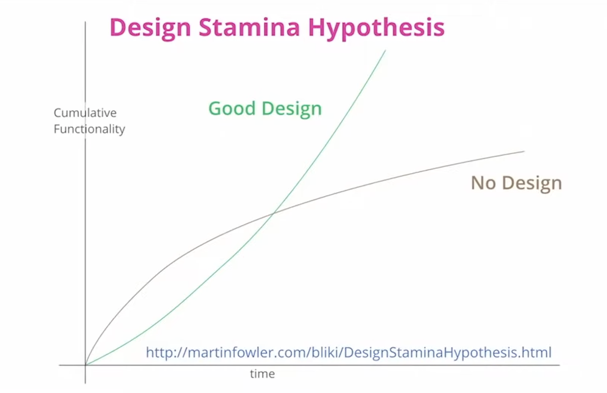

# 소프트웨어 아키텍쳐 패턴

    Difference between **Architecture Pattern** and **Design Pattern**
    Architecture Pattern:
    - It is high-level pattern that defined the overall system architecture.
    - Can be applied on System and Application Level
    - It is used for improving systemtic efficiency and sclaability
    Design Pattern:
    - Applied on class and object level.
    - Used for reusability and readability.

## 1. Layered pattern
## 2. Client-server pattern
## 3. Master-slave pattern
## 4. Pipe-filter pattern
## 5. Broker pattern
## 6. Peer-to-peer pattern
## 7. Event-bus pattern
## 8. Model-view-controller pattern
## 9. Blackboard pattern
##10. Interpreter pattern
