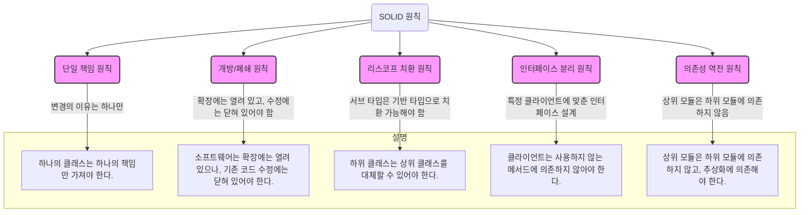
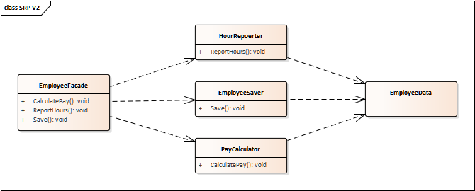
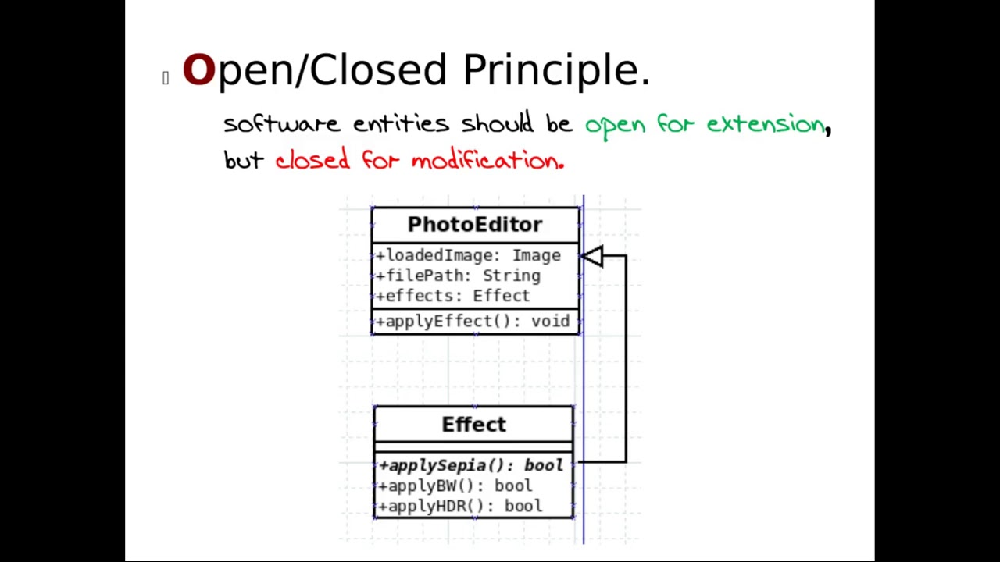
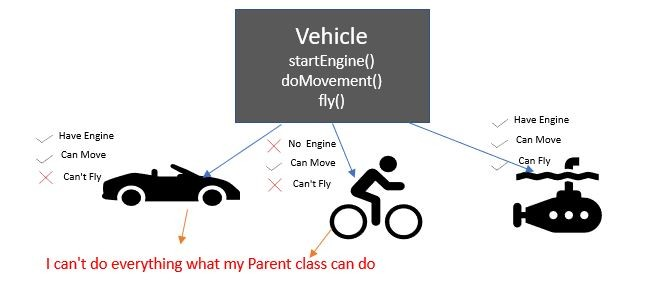
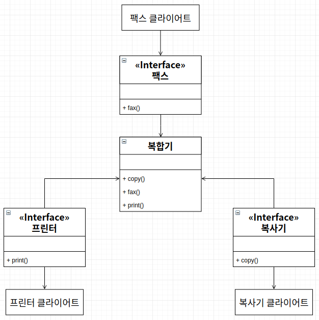
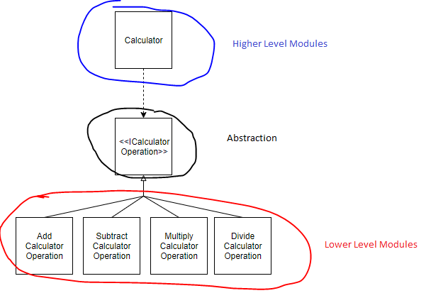

## SOLID 원칙 공부 노트
각 ipynb 설명내용 참조: https://velog.io/@haero_kim/SOLID-%EC%9B%90%EC%B9%99-%EC%96%B4%EB%A0%B5%EC%A7%80-%EC%95%8A%EB%8B%A4

### 1. SRP
이미지 참조: https://www.evertop.pl/en/understanding-solid-principles-single-responsibility/

### 2. OCP
이미지 참조:https://www.youtube.com/watch?v=H7oyqncSgEE

### 3. LSP
이미지 참조:https://www.linkedin.com/pulse/liskov-substitution-principle-mamata-raote-she-her-

### 4. ISP
이미지 참조:https://walbatrossw.github.io/oop/2018/07/27/07-solid-isp.html

### 5. DIP
이미지 참조: https://medium.com/@kedren.villena/simplifying-dependency-inversion-principle-dip-59228122649a

| 원칙                | 주요 개념                                                       | 주로 다루는 문제                           | 다른 원칙과의 차이점                                                   |
|---------------------|----------------------------------------------------------------|------------------------------------------|----------------------------------------------------------------------|
| **단일 책임 원칙 (SRP)** | 하나의 클래스는 하나의 책임만 가져야 한다                              | 클래스의 응집도, 유지보수성                          | 클래스가 여러 책임을 가질 때의 복잡도를 줄이는 데 초점을 맞춤. 주로 코드의 **역할 분리**에 집중. |
| **개방/폐쇄 원칙 (OCP)** | 소프트웨어는 확장에는 열려 있고 수정에는 닫혀 있어야 한다                    | 코드의 확장성, 유지보수 시 발생하는 리스크                | **기능 추가 시 기존 코드 수정 최소화**에 초점을 둠. 새로운 기능 추가 시 **수정**을 최소화.         |
| **리스코프 치환 원칙 (LSP)** | 자식 클래스는 부모 클래스로 치환될 수 있어야 한다                         | 다형성, 상속 관계에서의 일관성                      | 주로 **상속 구조에서의 일관성**에 중점을 둠. 부모 클래스의 기능을 자식 클래스가 깨뜨리지 않도록 함.|
| **인터페이스 분리 원칙 (ISP)** | 클라이언트는 사용하지 않는 메서드에 의존하지 않아야 한다                      | 불필요한 의존성, 인터페이스의 복잡성                   | **인터페이스 설계**에 초점을 맞춤. 사용하지 않는 메서드 의존성을 피하도록 인터페이스를 **분리**.     |
| **의존성 역전 원칙 (DIP)**   | 고수준 모듈은 저수준 모듈에 의존하지 않고, 추상화에 의존해야 한다               | 모듈 간의 의존성, 코드의 유연성                        | **모듈 간의 의존성**을 낮추는 데 중점을 둠. 고수준 모듈이 저수준 모듈에 의존하지 않도록 **추상화**에 의존.|
